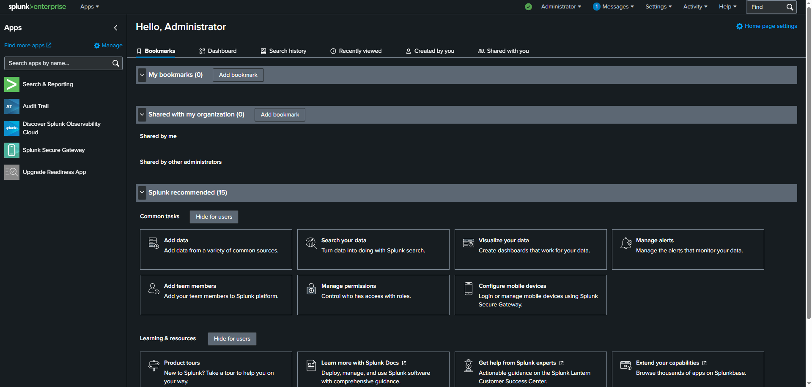
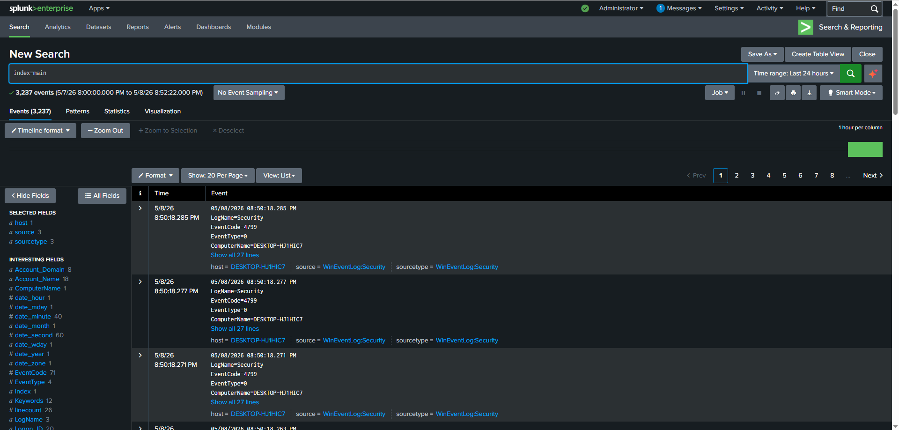
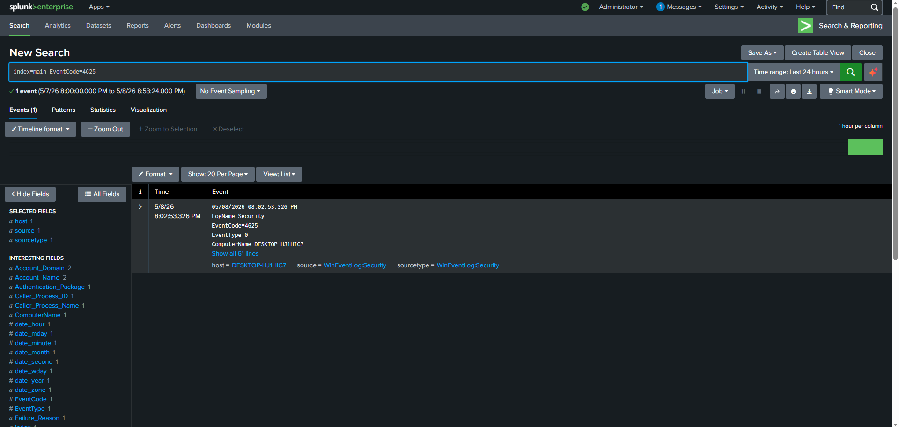
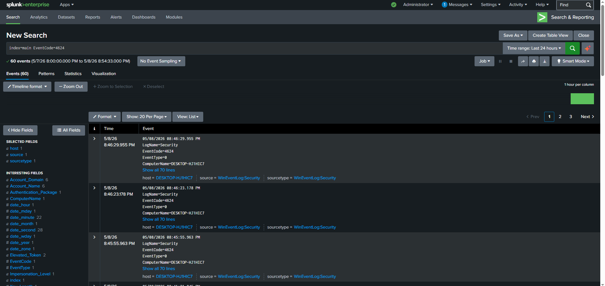
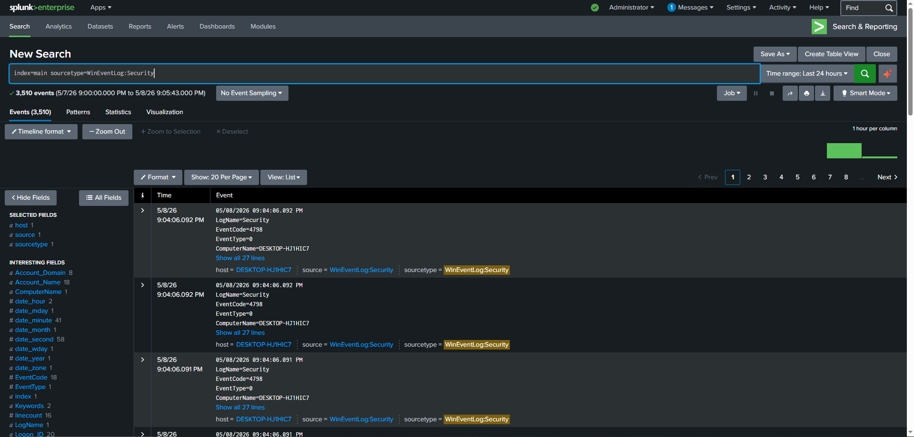
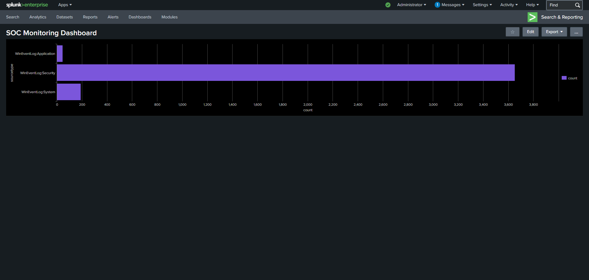

# Splunk SOC Monitoring Lab

## Overview
This project demonstrates a hands-on SOC (Security Operations Center) monitoring lab using Splunk Enterprise to collect, analyze, and visualize Windows security event logs. The lab focuses on security monitoring operations, Windows authentication event analysis, failed login detection, log investigation, and dashboard visualization.

The project simulates how SOC analysts use a SIEM (Security Information and Event Management) platform to investigate security-related activity and monitor Windows event logs within an enterprise environment.

---

## Objectives
- Configure and use Splunk Enterprise for security monitoring
- Ingest and analyze Windows Security Event Logs
- Investigate failed and successful authentication events
- Practice basic SPL (Search Processing Language) queries
- Create a SOC-style monitoring dashboard
- Strengthen familiarity with SIEM workflows and log analysis

---

## Technologies Used
- Splunk Enterprise
- Windows Event Viewer
- Windows Security Logs
- SPL (Search Processing Language)
- SIEM Monitoring Concepts

---

## Key Security Events Monitored

### Failed Login Attempts — Event ID 4625
Used Splunk to identify failed Windows authentication attempts and monitor suspicious login behavior.

### Successful Login Events — Event ID 4624
Monitored successful user authentication activity and login behavior using Windows Security logs.

### Windows Security Log Monitoring
Analyzed Windows Security Event Logs using Splunk search queries, filtering techniques, and event investigation methods.

### Dashboard Visualization
Created a SOC monitoring dashboard to visualize Windows event log activity and security monitoring data.

---

## Sample SPL Queries

### Failed Login Attempts
```spl
index=main EventCode=4625
```

### Successful Login Events
```spl
index=main EventCode=4624
```

### Windows Security Event Logs
```spl
index=main sourcetype=WinEventLog:Security
```

### General Event Search
```spl
index=main
```

---

## Project Screenshots

### Splunk Enterprise Environment
Demonstrates the Splunk Enterprise environment used throughout the lab.



---

### Windows Event Log Analysis
Shows ingestion and analysis of Windows event logs within Splunk.



---

### Failed Login Detection — Event ID 4625
Demonstrates investigation of failed Windows authentication attempts using Splunk SPL queries.



---

### Successful Login Monitoring — Event ID 4624
Shows monitoring and analysis of successful Windows authentication events.



---

### Windows Security Event Monitoring
Demonstrates monitoring and investigation of Windows Security event logs.



---

### SOC Monitoring Dashboard
Custom Splunk dashboard visualizing Windows event log activity and security monitoring data.




## Skills Demonstrated
- SIEM Monitoring
- Log Analysis
- Windows Event Investigation
- Security Event Monitoring
- Authentication Monitoring
- Dashboard Creation
- SPL Query Development
- Incident Investigation Fundamentals
- Security Operations Workflow

---

## Key Takeaways
- Improved understanding of SIEM workflows and SOC operations
- Practiced searching and filtering Windows Security logs using SPL
- Gained experience investigating authentication-related security events
- Strengthened familiarity with Splunk Enterprise dashboards and monitoring capabilities
- Developed hands-on cybersecurity operational experience using a real SIEM platform
- Built practical experience analyzing Windows event log data within Splunk

---
